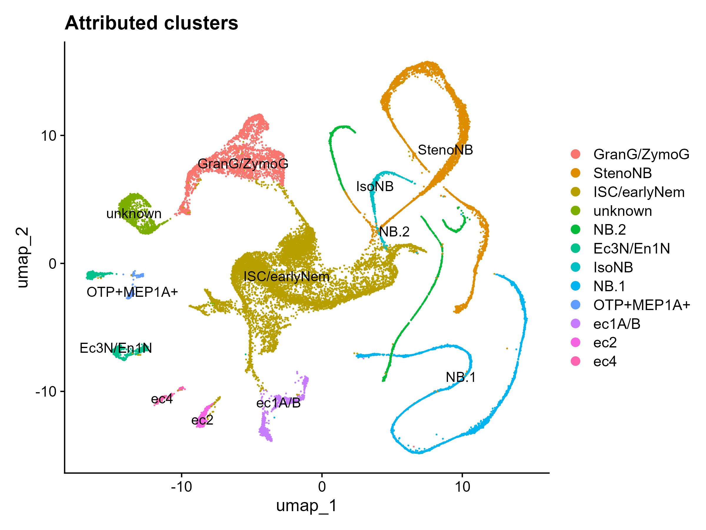

# Interstitial cells transcription factors in *Hydra Vulgaris* regeneration over 96 hours

Rotation in Celina Juliano's lab studying the timeline of hydra regeneration after bisection using scRNAseq obtained from Panagiotis Papasaikas from the Tsiairis lab.

## Introduction

Data from our collaborator Panagiotis rds file for a SingleCellExperiment object containing the single cell data for **the interstitial cells** of *Hydra Vulgaris* during multiples stages of regeneration after bisection

This data was mapped to *Hydra Magnipapillata (102)* "Drop-seq reads from 15 libraries generated for Hydra vulgaris strain AEP were mapped to the 2.0 genome assembly of closely related Hydra vulgaris strain 102
(available at <https://research.nhgri.nih.gov/hydra/>) and processed using the Hydra 2.0 gene models. Strain Hydra vulgaris 102 was formerly referred to as Hydra magnipapillata."

The sce object contains only the interstitial cells that were selected by Panagiotis using the ..... markers

The coldata of the object contain cell annotation including

-   quality metrics: nFeature nCount (not MT percentage interestingly)

-   batch info: either 2869 (3162 barcodes), 3113 (10352 barcodes), 3271
    (13279 barcodes), 3357 (3875 barcodes)

-   originating experiments (head or foot regeneration)

-   experimental time points

-   pseudo-axis assignment (vals.axis ranging from -1 to 1, increasing in
    the foot-tentacle direction)

-   mitotic and apoptotic signatures indices from 0 to 1

The rowdata contains gene annotation, using Entrez-gene identifiers. I
have also noticed that in the sce objects there's

-   PCA, tSNE and UMAP coordinates for reduced dimensions + corrected
    for batch values

-   assay metafeatures hold gene_id, product, gene, is.rib.prot.gene
    (T/F), HypoMarkers (T/F), ccyle (T/F), apopt (T/F) etc

I converted the sce objects into a seurat object and did data processing + analysis.

## Reports summary

-    interstitial_report1
-    interstitial_report2_cluster_attribution
-    interstitial_report3
-    interstitial_report4_cluster_attribution
-    interstitial_report5_transcription_timeline

## Interstitial_report1

-    Contains the exploration of the data (batches, features, metadata etc)
-    Quality check based on nFeatures and nCounts (no mitochondrial genes in the 105 genome)
-    Scaling using SCTransform() and regression (or not) of the batch variable
-    Selection of the first 28 dimensions for UMAP projection
-    PCA, UMAP, Clustering at different resolutions (0.025, 0.1, 0.3)

## Interstitial_report2_cluster_attribution

Subsetting by head/foot and timepoint for both regressed and unregressed
Not batch regressed
Batch regressed
Cluster attribution
UMAP at 0.025 resolution
Finding markers per clusters
-    DotPlot of top 5 differentially expressed markers per clusters
-    DotPlot of theoretical markers for neurons and other interstitial cells
-    UMAPs of names markers (excludes uncharacterized transcripts)

## Interstitial_report3

Contains the same thing as the first report but explores the n_neighbors parameter

Does not contain the regressed data as the batch and timepoints variables overlapped weirdly in the experimental design

## Interstitial_report4_cluster_attribution

Contains the same things as report2 BUT
-    more markers
-    plots using the regressed data were discarded
-    clusters were attributed
-    we now have a first glimpse at transcription factor expression

## Interstitial_report5_transcription_timeline

Subclustered to only neurons in order to study neuron subtypes and appearances throughout regenaration.
Allows for FindMarkers between clusters and timepoints.

Filtered to neurons only and re-clustered:

-    PCA, UMAP at 0.025 resolution
-    New cluster attribution (9 neuronal cell types)
-    Subgrouped per timepoints and per regenerating organ (head vs foot)
-    Plotting of cell population number over time (head vs foot)
-    Transcription factor of interest expression: Feature plot and clustered dotplot

## Interstitial_report6_population_evolution

Final report for this rotation. Contains:

-    Notes on a meeting with Celina and Hannah and what to change in report 5
-    UMAP and cluster labelling at resolution = 0.1 instead of 0.025
-    Subsetting by cluster and over time
-    Evolution of cell population over time: Raw counts and percentage composition of the Hydra + divided by hear of foot
-    Transcription factor expression: Feature plot all timepoints + Dotplot over time
-    Transcription factor expression: Over time

This report describes a changing cell population and ties it back to specific transcription factor expression.

## Nota Bene

The 102 genome is very fractionated and is poorly annotated compared to current available constructs.
I had to manually cross HVAEP1 genome for the previously established celltype markers with the 102 genome.
I did that by taking the HVAEP1 fasta file, blasting every established cell type marker transcript and finding if there's a >80% match for a transcript in 102. 
Then I went back to the annotation file and changed the name of the transcript in a duplicated Symbol column called Symbol_updated.
I also manually checked annotated genes that had a transcript in 102 but the ID didn't reflect it.
This is stored in an excel document called "mcbi_dataset_MH_annotated.xlsx"

